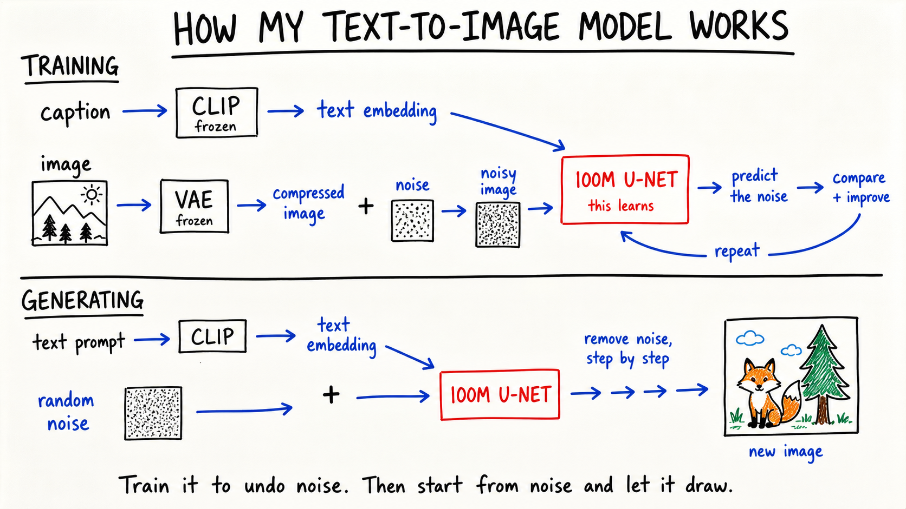

# diagrams

An installable agent skill for turning a described workflow into a clear, hand-drawn whiteboard diagram.

The repository combines a strict intake gate, the SCALE diagram standard, a dependency-free prompt compiler, and visual QA rules. If a request does not explain what the diagram is about or how its parts connect, the agent asks one focused question instead of inventing a generic workflow.



## Install with the skills CLI

```bash
npx skills add cneuralnetwork/diagrams
```

To install it globally without the project-scope prompt:

```bash
npx skills add cneuralnetwork/diagrams --global
```

## Install manually for Codex

```bash
git clone https://github.com/cneuralnetwork/diagrams.git "${CODEX_HOME:-$HOME/.codex}/skills/whiteboard-diagrams"
```

Then invoke it with a concrete request:

```text
Use $whiteboard-diagrams to explain how retrieval-augmented generation works.
Show the question going to an embedding model, vector search returning passages,
the passages joining the prompt, and the LLM producing an answer with citations.
```

If the workflow is missing, the skill asks:

> What should the diagram explain, and what are the main steps or components and how do they connect?

## Build a production prompt manually

Create a JSON spec using `references/INTAKE.md`, then run:

```bash
python scripts/diagram_prompt.py validate examples/text-to-image-model.json
python scripts/diagram_prompt.py build examples/text-to-image-model.json --output diagram-prompt.txt
```

The resulting text is a complete prompt for an image-generation model. It includes exact labels, causal relationships, whiteboard art direction, margins, and failure constraints.

## What is included

- `SKILL.md`: the agent workflow and trigger contract.
- `SCALE.md`: the detailed diagram design and QA standard.
- `AGENTS.md`: repository-level instructions for coding agents.
- `scripts/diagram_prompt.py`: deterministic spec validation and prompt compilation.
- `references/INTAKE.md`: the JSON input contract.
- `references/EXAMPLES.md`: reusable topology examples.
- `assets/text-to-image-model.png`: the verified style reference.
- `tests/`: script behavior tests.

## License

MIT
