# Skill Dependency Graph & Resolution Matrix

> Auto-generated by `scripts/dependency_graph.py`.
> **Total Skills Analyzed**: 388
> **Declared Dependencies**: 19
> **Circular Dependencies Detected**: 0

---

## Skill Prerequisites Summary

| Skill | Direct Prerequisites | Dependent Skills (Dependents) |
|---|---|---|
| `access` | *None* | *None* |
| `agent-architecture-audit` | *None* | *None* |
| `agent-development` | *None* | *None* |
| `agent-eval` | *None* | *None* |
| `agent-harness-construction` | *None* | *None* |
| `agent-introspection-debugging` | *None* | *None* |
| `agent-payment-x402` | *None* | *None* |
| `agent-self-evaluation` | *None* | *None* |
| `agent-sort` | *None* | *None* |
| `agentic-engineering` | *None* | *None* |
| `agentic-os` | *None* | *None* |
| `ai-first-engineering` | *None* | *None* |
| `ai-regression-testing` | *None* | *None* |
| `api-connector-builder` | *None* | *None* |
| `architecture-decision-records` | *None* | *None* |
| `article-writing` | *None* | *None* |
| `automation-audit-ops` | *None* | *None* |
| `autonomous-agent-harness` | *None* | *None* |
| `autonomous-loops` | `tdd-workflow` | *None* |
| `benchmark` | *None* | *None* |
| `benchmark-methodology` | *None* | *None* |
| `benchmark-optimization-loop` | *None* | *None* |
| `blender-motion-state-inspection` | *None* | *None* |
| `blueprint` | *None* | *None* |
| `brain-to-docs` | *None* | *None* |
| `brand-discovery` | *None* | *None* |
| `brand-voice` | *None* | *None* |
| `browser-qa` | *None* | *None* |
| `canary-watch` | *None* | *None* |
| `carrier-relationship-management` | *None* | *None* |
| `caveman` | *None* | *None* |
| `ci-cd-pipeline-builder` | *None* | *None* |
| `cisco-ios-patterns` | *None* | *None* |
| `ck` | *None* | *None* |
| `claude-automation-recommender` | *None* | *None* |
| `claude-devfleet` | *None* | *None* |
| `claude-md-improver` | *None* | *None* |
| `click-path-audit` | `systematic-debugging`, `verification-before-completion` | *None* |
| `clickhouse-io` | *None* | *None* |
| `cloudflare-deploy` | *None* | *None* |
| `code-refactor` | *None* | *None* |
| `code-review-and-quality` | *None* | *None* |
| `code-review-expert` | *None* | *None* |
| `code-reviewer` | *None* | *None* |
| `code-tour` | *None* | *None* |
| `codebase-onboarding` | *None* | *None* |
| `codehealth-mcp` | `tdd-workflow` | *None* |
| `command-development` | *None* | *None* |
| `competitive-platform-analysis` | *None* | *None* |
| `competitive-report-structure` | *None* | *None* |
| `config-gc` | *None* | *None* |
| `configure` | *None* | *None* |
| `configure-ecc` | `tdd-workflow` | *None* |
| `connections-optimizer` | *None* | *None* |
| `content-engine` | *None* | *None* |
| `content-hash-cache-pattern` | *None* | *None* |
| `context-budget` | *None* | *None* |
| `continuous-agent-loop` | *None* | *None* |
| `continuous-learning` | *None* | *None* |
| `continuous-learning-v2` | *None* | *None* |
| `cost-aware-llm-pipeline` | *None* | *None* |
| `cost-tracking` | *None* | *None* |
| `council` | *None* | *None* |
| `create-cli` | *None* | *None* |
| `crosspost` | *None* | *None* |
| `customer-billing-ops` | *None* | *None* |
| `customs-trade-compliance` | *None* | *None* |
| `dashboard-builder` | *None* | *None* |
| `data-scraper-agent` | *None* | *None* |
| `data-throughput-accelerator` | *None* | *None* |
| `database-migrations` | *None* | *None* |
| `debugging-code` | *None* | *None* |
| `deep-research` | *None* | *None* |
| `defi-amm-security` | *None* | *None* |
| `delivery-gate` | *None* | *None* |
| `dependency-auditor` | *None* | *None* |
| `deployment-patterns` | *None* | *None* |
| `design-an-interface` | *None* | *None* |
| `diagnose` | *None* | *None* |
| `django-security` | *None* | *None* |
| `doc-coauthoring` | *None* | *None* |
| `docker-patterns` | *None* | *None* |
| `document-extraction` | *None* | *None* |
| `document-workflows` | *None* | *None* |
| `documentation-lookup` | *None* | *None* |
| `docx` | *None* | *None* |
| `dynamic-workflow-mode` | *None* | *None* |
| `e2e-testing` | *None* | *None* |
| `ecc-guide` | *None* | *None* |
| `ecc-recipes` | *None* | *None* |
| `ecc-tools-cost-audit` | `tdd-workflow` | *None* |
| `edit-article` | *None* | *None* |
| `electronics-sourcing` | *None* | *None* |
| `email-ops` | *None* | *None* |
| `energy-procurement` | *None* | *None* |
| `enterprise-agent-ops` | *None* | *None* |
| `error-handling` | *None* | *None* |
| `eval-harness` | *None* | *None* |
| `evm-token-decimals` | *None* | *None* |
| `exa-search` | *None* | *None* |
| `example-command` | *None* | *None* |
| `example-skill` | *None* | *None* |
| `fal-ai-media` | *None* | *None* |
| `feature-planning` | *None* | *None* |
| `finance-billing-ops` | *None* | *None* |
| `find-bugs` | *None* | *None* |
| `find-skills` | *None* | *None* |
| `flox-environments` | *None* | *None* |
| `foundation-models-on-device` | *None* | *None* |
| `frontend-design` | *None* | *None* |
| `fullstack-feature-scaffold` | *None* | *None* |
| `gan-style-harness` | *None* | *None* |
| `gateguard` | *None* | *None* |
| `get-api-docs` | *None* | *None* |
| `gget` | *None* | *None* |
| `gh-address-comments` | *None* | *None* |
| `gh-fix-ci` | *None* | *None* |
| `git-guardrails-claude-code` | *None* | *None* |
| `git-pushing` | *None* | *None* |
| `git-workflow` | *None* | *None* |
| `git-workflow-and-versioning` | *None* | *None* |
| `github-ops` | *None* | *None* |
| `google-eng-practices` | *None* | *None* |
| `google-style-common` | *None* | *None* |
| `google-style-cpp` | *None* | *None* |
| `google-style-go` | *None* | *None* |
| `google-style-java` | *None* | *None* |
| `google-style-javascript` | *None* | *None* |
| `google-style-python` | *None* | *None* |
| `google-style-typescript` | *None* | *None* |
| `google-workspace-ops` | *None* | *None* |
| `graphify` | *None* | *None* |
| `grill-me` | *None* | *None* |
| `grill-with-docs` | *None* | *None* |
| `growth-log` | *None* | *None* |
| `gsd-add-phase` | *None* | *None* |
| `gsd-add-tests` | *None* | *None* |
| `gsd-add-todo` | *None* | *None* |
| `gsd-audit-milestone` | *None* | *None* |
| `gsd-autonomous` | *None* | *None* |
| `gsd-check-todos` | *None* | *None* |
| `gsd-cleanup` | *None* | *None* |
| `gsd-complete-milestone` | *None* | *None* |
| `gsd-debug` | *None* | *None* |
| `gsd-discuss-phase` | *None* | *None* |
| `gsd-do` | *None* | *None* |
| `gsd-execute-phase` | *None* | *None* |
| `gsd-health` | *None* | *None* |
| `gsd-help` | *None* | *None* |
| `gsd-insert-phase` | *None* | *None* |
| `gsd-join-discord` | *None* | *None* |
| `gsd-list-phase-assumptions` | *None* | *None* |
| `gsd-map-codebase` | *None* | *None* |
| `gsd-new-milestone` | *None* | *None* |
| `gsd-new-project` | *None* | *None* |
| `gsd-note` | *None* | *None* |
| `gsd-pause-work` | *None* | *None* |
| `gsd-plan-milestone-gaps` | *None* | *None* |
| `gsd-plan-phase` | *None* | *None* |
| `gsd-progress` | *None* | *None* |
| `gsd-quick` | *None* | *None* |
| `gsd-reapply-patches` | *None* | *None* |
| `gsd-remove-phase` | *None* | *None* |
| `gsd-research-phase` | *None* | *None* |
| `gsd-resume-work` | *None* | *None* |
| `gsd-set-profile` | *None* | *None* |
| `gsd-settings` | *None* | *None* |
| `gsd-stats` | *None* | *None* |
| `gsd-ui-phase` | *None* | *None* |
| `gsd-ui-review` | *None* | *None* |
| `gsd-update` | *None* | *None* |
| `gsd-validate-phase` | *None* | *None* |
| `gsd-verify-work` | *None* | *None* |
| `healthcare-cdss-patterns` | *None* | *None* |
| `healthcare-emr-patterns` | *None* | *None* |
| `healthcare-eval-harness` | *None* | *None* |
| `healthcare-phi-compliance` | *None* | *None* |
| `hermes-imports` | *None* | *None* |
| `hipaa-compliance` | *None* | *None* |
| `homelab-network-readiness` | *None* | *None* |
| `homelab-network-setup` | *None* | *None* |
| `homelab-pihole-dns` | *None* | *None* |
| `homelab-vlan-segmentation` | *None* | *None* |
| `homelab-wireguard-vpn` | *None* | *None* |
| `hook-development` | *None* | *None* |
| `hookify-rules` | *None* | *None* |
| `i-have-adhd` | *None* | *None* |
| `improve-codebase-architecture` | *None* | *None* |
| `inherit-legacy-style` | *None* | *None* |
| `integrate` | *None* | *None* |
| `intent-driven-development` | *None* | *None* |
| `interview-style-doc-building` | *None* | *None* |
| `inventory-demand-planning` | *None* | *None* |
| `investor-materials` | *None* | *None* |
| `investor-outreach` | *None* | *None* |
| `ios-icon-gen` | *None* | *None* |
| `iterative-retrieval` | *None* | *None* |
| `ito-basket-compare` | *None* | *None* |
| `ito-compute` | *None* | *None* |
| `ito-data-atlas-agent` | *None* | *None* |
| `ito-market-intelligence` | *None* | *None* |
| `ito-trade-planner` | *None* | *None* |
| `jira-integration` | *None* | *None* |
| `jpa-patterns` | *None* | *None* |
| `jupyter-notebook` | *None* | *None* |
| `knowledge-ops` | *None* | *None* |
| `kubernetes-patterns` | *None* | *None* |
| `laravel-security` | `tdd-workflow` | *None* |
| `latency-critical-systems` | *None* | *None* |
| `lead-intelligence` | *None* | *None* |
| `liquid-glass-design` | *None* | *None* |
| `literature-review` | *None* | *None* |
| `llm-trading-agent-security` | *None* | *None* |
| `login-flows` | *None* | *None* |
| `logistics-exception-management` | *None* | *None* |
| `loop-design-check` | *None* | *None* |
| `mailtrap-email-integration` | *None* | *None* |
| `manim-video` | *None* | *None* |
| `market-research` | *None* | *None* |
| `marketing-campaign` | *None* | *None* |
| `mcp-builder` | *None* | *None* |
| `mcp-integration` | *None* | *None* |
| `messages-ops` | *None* | *None* |
| `migrate-to-shoehorn` | *None* | *None* |
| `mysql-patterns` | *None* | *None* |
| `nanoclaw-repl` | *None* | *None* |
| `nasa-power-of-ten-python` | *None* | *None* |
| `netmiko-ssh-automation` | *None* | *None* |
| `network-bgp-diagnostics` | *None* | *None* |
| `network-config-validation` | *None* | *None* |
| `network-interface-health` | *None* | *None* |
| `new-project` | *None* | *None* |
| `nextjs-15-expert` | *None* | *None* |
| `no-ai-slop` | *None* | *None* |
| `nodejs-keccak256` | *None* | *None* |
| `nutrient-document-processing` | *None* | *None* |
| `obsidian-vault` | *None* | *None* |
| `openclaw-persona-forge` | *None* | *None* |
| `opensource-pipeline` | *None* | *None* |
| `orch-add-feature` | *None* | *None* |
| `orch-build-mvp` | *None* | *None* |
| `orch-change-feature` | *None* | *None* |
| `orch-fix-defect` | *None* | *None* |
| `orch-pipeline` | `tdd-workflow` | *None* |
| `orch-refine-code` | *None* | *None* |
| `parallel-execution-optimizer` | *None* | *None* |
| `pdf` | *None* | *None* |
| `performance-profiler` | *None* | *None* |
| `perl-security` | *None* | *None* |
| `plan-canvas` | *None* | *None* |
| `plan-orchestrate` | `tdd-workflow` | *None* |
| `plankton-code-quality` | *None* | *None* |
| `planning-and-task-breakdown` | *None* | *None* |
| `playground` | *None* | *None* |
| `playwright` | *None* | *None* |
| `playwright-interactive` | *None* | *None* |
| `plugin-settings` | *None* | *None* |
| `plugin-structure` | *None* | *None* |
| `postgres-patterns` | *None* | *None* |
| `pptx` | *None* | *None* |
| `pr-review-expert` | *None* | *None* |
| `prd-to-issues` | *None* | *None* |
| `prd-to-plan` | *None* | *None* |
| `prediction-market-oracle-research` | *None* | *None* |
| `prediction-market-risk-review` | *None* | *None* |
| `prisma-patterns` | *None* | *None* |
| `product-capability` | `tdd-workflow` | *None* |
| `product-lens` | *None* | *None* |
| `production-audit` | `tdd-workflow` | *None* |
| `production-scheduling` | *None* | *None* |
| `project-flow-ops` | *None* | *None* |
| `prompt-optimizer` | `tdd-workflow` | *None* |
| `pubmed-database` | *None* | *None* |
| `python-ts-interop-mcp-builder` | *None* | *None* |
| `qa` | *None* | *None* |
| `quality-nonconformance` | *None* | *None* |
| `quarkus-security` | *None* | *None* |
| `ralphinho-rfc-pipeline` | *None* | *None* |
| `receiving-code-review` | *None* | *None* |
| `recursive-decision-ledger` | *None* | *None* |
| `redis-patterns` | *None* | *None* |
| `regex-vs-llm-structured-text` | *None* | *None* |
| `remotion-video-creation` | *None* | *None* |
| `render-deploy` | *None* | *None* |
| `repo-scan` | *None* | *None* |
| `request-refactor-plan` | *None* | *None* |
| `requesting-code-review` | *None* | *None* |
| `research-ops` | *None* | *None* |
| `returns-reverse-logistics` | *None* | *None* |
| `rules-distill` | *None* | *None* |
| `safety-guard` | *None* | *None* |
| `santa-method` | *None* | *None* |
| `scaffold-exercises` | *None* | *None* |
| `scholar-evaluation` | *None* | *None* |
| `screenshot` | *None* | *None* |
| `search-first` | *None* | *None* |
| `security-and-hardening` | *None* | *None* |
| `security-best-practices` | *None* | *None* |
| `security-bounty-hunter` | *None* | *None* |
| `security-ownership-map` | *None* | *None* |
| `security-review` | *None* | *None* |
| `security-scan` | *None* | *None* |
| `security-threat-model` | *None* | *None* |
| `sentry` | *None* | *None* |
| `sentry-android-sdk` | *None* | *None* |
| `sentry-browser-sdk` | *None* | *None* |
| `sentry-cloudflare-sdk` | *None* | *None* |
| `sentry-cocoa-sdk` | *None* | *None* |
| `sentry-code-review` | *None* | *None* |
| `sentry-create-alert` | *None* | *None* |
| `sentry-dotnet-sdk` | *None* | *None* |
| `sentry-elixir-sdk` | *None* | *None* |
| `sentry-feature-setup` | *None* | *None* |
| `sentry-fix-issues` | *None* | *None* |
| `sentry-flutter-sdk` | *None* | *None* |
| `sentry-go-sdk` | *None* | *None* |
| `sentry-nestjs-sdk` | *None* | *None* |
| `sentry-nextjs-sdk` | *None* | *None* |
| `sentry-node-sdk` | *None* | *None* |
| `sentry-otel-exporter-setup` | *None* | *None* |
| `sentry-php-sdk` | *None* | *None* |
| `sentry-pr-code-review` | *None* | *None* |
| `sentry-python-sdk` | *None* | *None* |
| `sentry-react-native-sdk` | *None* | *None* |
| `sentry-react-sdk` | *None* | *None* |
| `sentry-ruby-sdk` | *None* | *None* |
| `sentry-sdk-setup` | *None* | *None* |
| `sentry-sdk-skill-creator` | *None* | *None* |
| `sentry-sdk-upgrade` | *None* | *None* |
| `sentry-setup-ai-monitoring` | *None* | *None* |
| `sentry-svelte-sdk` | *None* | *None* |
| `sentry-workflow` | *None* | *None* |
| `seo` | *None* | *None* |
| `setup-matt-pocock-skills` | `tdd-workflow` | *None* |
| `setup-pre-commit` | *None* | *None* |
| `skill-creator` | `tdd-workflow` | *None* |
| `skill-development` | *None* | *None* |
| `skill-scout` | *None* | *None* |
| `skill-security-auditor` | *None* | *None* |
| `skill-stocktake` | *None* | *None* |
| `social-graph-ranker` | *None* | *None* |
| `social-publisher` | *None* | *None* |
| `springboot-security` | *None* | *None* |
| `strategic-compact` | `tdd-workflow` | *None* |
| `stripe-best-practices` | *None* | *None* |
| `supabase-expert` | *None* | *None* |
| `supabase-postgres-best-practices` | *None* | *None* |
| `swift-actor-persistence` | *None* | *None* |
| `swift-concurrency-6-2` | *None* | *None* |
| `swift-protocol-di-testing` | *None* | *None* |
| `swiftui-patterns` | *None* | *None* |
| `syncause-debugger` | *None* | *None* |
| `systematic-debugging` | `verification-before-completion` | `click-path-audit` |
| `tailwind-radix-expert` | *None* | *None* |
| `taste` | *None* | *None* |
| `tavily-best-practices` | *None* | *None* |
| `tdd` | *None* | *None* |
| `tdd-workflow` | *None* | `autonomous-loops`, `codehealth-mcp`, `configure-ecc`, `ecc-tools-cost-audit`, `laravel-security`, `setup-matt-pocock-skills`, `orch-pipeline`, `plan-orchestrate`, `product-capability`, `production-audit`, `prompt-optimizer`, `skill-creator`, `strategic-compact`, `team-builder`, `terminal-ops`, `test-driven-development` |
| `team-agent-orchestration` | *None* | *None* |
| `team-builder` | `tdd-workflow` | *None* |
| `tech-debt-tracker` | *None* | *None* |
| `terminal-ops` | `tdd-workflow` | *None* |
| `test-driven-development` | `tdd-workflow` | *None* |
| `testing-loop-master` | *None* | *None* |
| `token-budget-advisor` | *None* | *None* |
| `triage-issue` | *None* | *None* |
| `type-architecture-analyzer` | *None* | *None* |
| `ubiquitous-language` | *None* | *None* |
| `ui-demo` | *None* | *None* |
| `uncloud` | *None* | *None* |
| `unified-memory` | *None* | *None* |
| `unified-notifications-ops` | *None* | *None* |
| `uspto-database` | *None* | *None* |
| `vercel-deploy` | *None* | *None* |
| `verification-before-completion` | *None* | `click-path-audit`, `systematic-debugging` |
| `verification-loop` | *None* | *None* |
| `video-editing` | *None* | *None* |
| `videodb` | *None* | *None* |
| `visa-doc-translate` | *None* | *None* |
| `windows-desktop-e2e` | *None* | *None* |
| `workspace-surface-audit` | *None* | *None* |
| `write-a-prd` | *None* | *None* |
| `write-a-skill` | *None* | *None* |
| `writing-hookify-rules` | *None* | *None* |
| `x-api` | *None* | *None* |
| `xlsx` | *None* | *None* |
| `yeet` | *None* | *None* |
| `zoom-out` | *None* | *None* |

---

## Visual Dependency Graph (Mermaid)

```mermaid
graph TD
    autonomous_loops["autonomous-loops"] --> tdd_workflow["tdd-workflow"]
    click_path_audit["click-path-audit"] --> systematic_debugging["systematic-debugging"]
    click_path_audit["click-path-audit"] --> verification_before_completion["verification-before-completion"]
    codehealth_mcp["codehealth-mcp"] --> tdd_workflow["tdd-workflow"]
    configure_ecc["configure-ecc"] --> tdd_workflow["tdd-workflow"]
    ecc_tools_cost_audit["ecc-tools-cost-audit"] --> tdd_workflow["tdd-workflow"]
    laravel_security["laravel-security"] --> tdd_workflow["tdd-workflow"]
    orch_pipeline["orch-pipeline"] --> tdd_workflow["tdd-workflow"]
    plan_orchestrate["plan-orchestrate"] --> tdd_workflow["tdd-workflow"]
    product_capability["product-capability"] --> tdd_workflow["tdd-workflow"]
    production_audit["production-audit"] --> tdd_workflow["tdd-workflow"]
    prompt_optimizer["prompt-optimizer"] --> tdd_workflow["tdd-workflow"]
    setup_matt_pocock_skills["setup-matt-pocock-skills"] --> tdd_workflow["tdd-workflow"]
    skill_creator["skill-creator"] --> tdd_workflow["tdd-workflow"]
    strategic_compact["strategic-compact"] --> tdd_workflow["tdd-workflow"]
    systematic_debugging["systematic-debugging"] --> verification_before_completion["verification-before-completion"]
    team_builder["team-builder"] --> tdd_workflow["tdd-workflow"]
    terminal_ops["terminal-ops"] --> tdd_workflow["tdd-workflow"]
    test_driven_development["test-driven-development"] --> tdd_workflow["tdd-workflow"]
```

